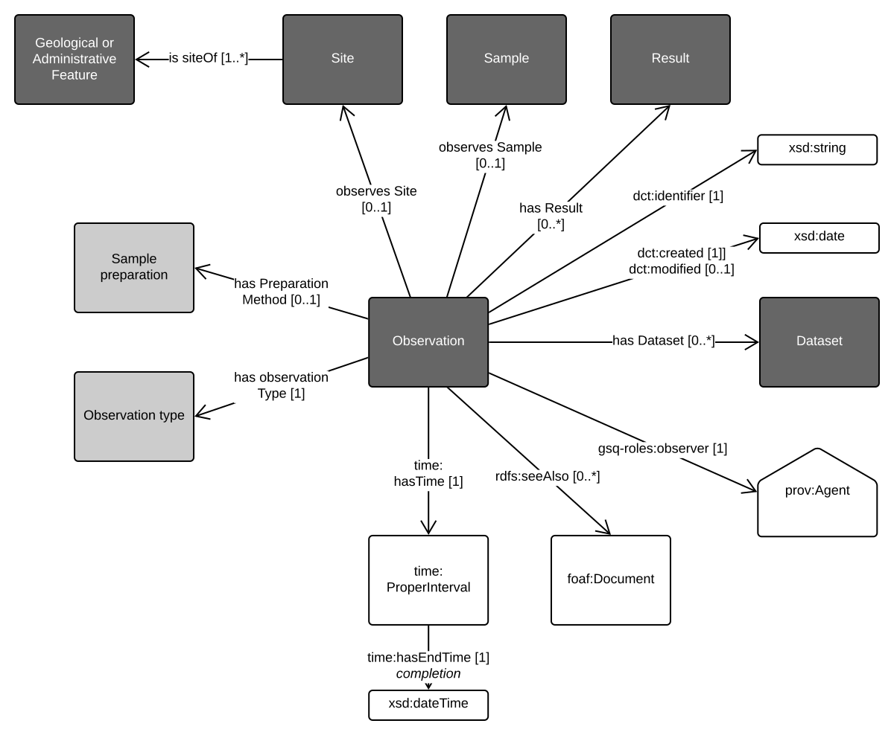

# GSQ Observation Profile
This profile describes the `observation` concept.

GSQ uses `observation` to describe the act of carrying out an observation using a procedure to estimate or calculate a value of a geological or administrative feature.

 
Figure 1: Observation profile

Figure 1. shows the template Observation profile used by GSQ.

## Profile Resources
This profile is presented as a series of files that perform different roles:

1. [model/](model/) - the *model* folder contains this profile's models in both graphical (SVG) and machine-readable, textual, form ( [RDF](https://www.w3.org/RDF/) turtle).
2. [shapes/](shapes/) - folder containing SHACL shapes files used to validate data's conformance to this profile's model.
3. [profile.ttl](profile.ttl) - the profile declaration. A description of all of the items in this profile (the formal model, validating resources, documentation etc.) according to the W3C's [Profiles Ontology](https://www.w3.org/TR/dx-prof/) which describes how all the parts related to one another, the roles they play (to give *guidance* for use, to *validate* data etc.) and how this profile *profiles* the various standards listed above.

## GSQ classes
Classes used in this profile:
1. [GSQ Geological Feature](https://github.com/geological-survey-of-queensland/geofeatures-ont)
2. [GSQ Administrative Feature](https://github.com/geological-survey-of-queensland/geoadmin-features-ont)
3. [GSQ Site](https://github.com/geological-survey-of-queensland/gsq-site-profile)
4. [GSQ Sample](https://github.com/geological-survey-of-queensland/gsq-sample-profile)
5. [GSQ Result](https://github.com/geological-survey-of-queensland/gsq-results-profile)
6. [GSQ Dataset](https://github.com/geological-survey-of-queensland/gsq-dataset-profile)

## OWL classes
1. [dct:identifier](https://w3c.github.io/dxwg/dcat/#Property:resource_identifier)
2. [dct:created](https://w3c.github.io/dxwg/dcat/)
3. [dct:modified](https://w3c.github.io/dxwg/dcat/#Property:resource_update_date)
4. [gsq-roles:observer](http://vocabs.gsq.digital/vocabulary/gsq-roles) - the author of the report
5. [rdfs:seeAlso](https://www.w3.org/TR/rdf-schema/#ch_seealso) - refers to secondary metadata
6. [time:hasTime](https://www.w3.org/TR/owl-time/#time:Instant)
7. [time:hasEndTime](https://www.w3.org/TR/owl-time/#time:hasBeginning)

## [Distribution](https://w3c.github.io/dxwg/dcat/#Class:Distribution) properties not shown in the diagram:
No distribution properties for Survey template

## Vocabularies
1. [Sample preparation](http://vocabs.gsq.digital/vocabulary/sample-preparation-methods)
2. [Observation type](http://vocabs.gsq.digital/vocabulary/geological-observation-type)

## Licence
The content of this repository is licensed for use with the [Creative Commons 4.0 License](https://creativecommons.org/licenses/by/4.0/). See the [license deed](LICENSE) for details.

## Contacts 
*owner*:  
**Mark Gordon**  
*Director - Geoscience Information*  
Geological Survey of Queensland  
<mark.gordon@dnrme.qld.gov.au>  

*author*:  
**Your Name**  
*Your Role Title - Your Unit*  
Geological Survey of Queensland  
<your.email@dnrme.qld.gov.au>
